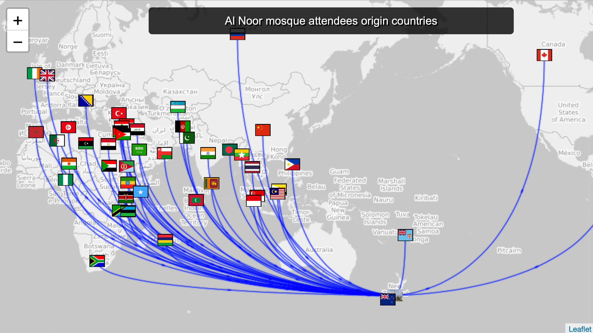
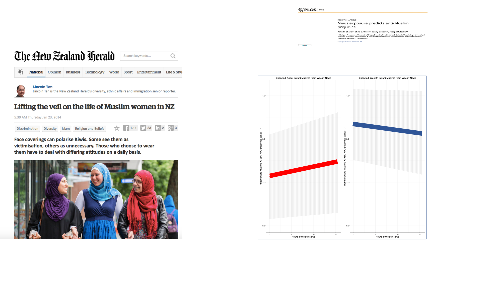
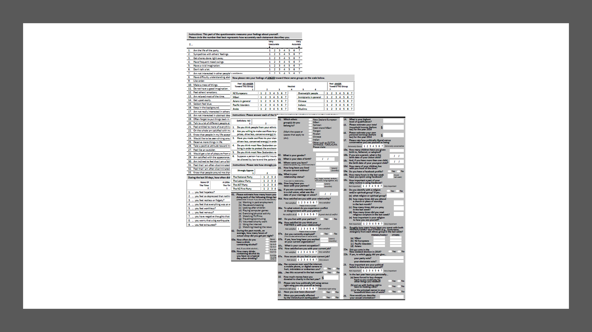
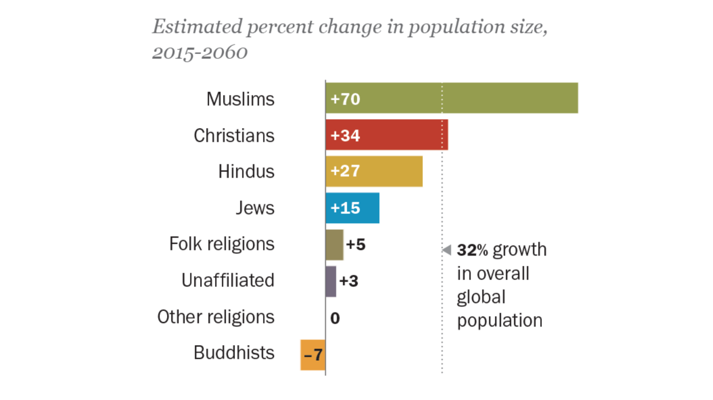
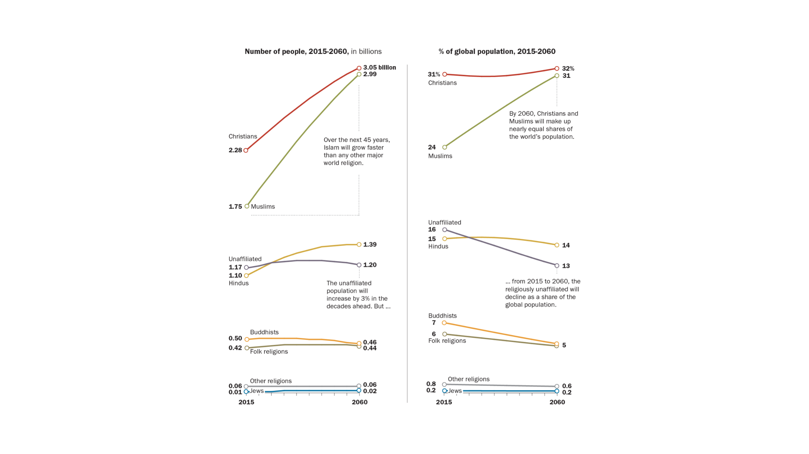

```{r global_options,  include = FALSE}
#        
knitr::opts_chunk$set(message=FALSE, 
                      warning=FALSE,
                      collapse =TRUE,
                      echo=FALSE)
                      #results="hide", 
                     # fig.width= 10,
                     # fig.height=8)
# read libraries
```
```{r libs, include=FALSE}
library("tidyverse")
library("here")
library("equatiomatic")
library("lubridate")
library("ggplot2")
library("ggthemes") #themes
library("ggpubr")
library("viridis")
library("patchwork")
library("ggforce")
library("kableExtra")
library("lme4")
library("brms")
library("rstan")
library("rstanarm")
library("bayesplot")
library("easystats")
library("kableExtra")
library("broom")
library("tidybayes")
library("bmlm")
# rstan options
rstan_options(auto_write = TRUE)
options(mc.cores = parallel::detectCores ())
theme_set(theme_classic())
```
```{r data, cache = TRUE, include=FALSE}
#import data
df <- readRDS(here::here("data", "df"))
```
```{r dataprep, cache=TRUE, include=FALSE}
# prepare data
dt <- df %>%
  dplyr::filter(YearMeasured == 1)  %>%
  dplyr::filter(
    Wave == 2019 |
      Wave == 2018 |
      Wave == 2017 |
      Wave == 2016 |
      Wave == 2015 |
      Wave == 2014 |
      Wave == 2013 |
      Wave == 2012
  ) %>%
  dplyr::group_by(Id) %>% filter(n() > 2) %>%
  dplyr::ungroup(Id)  %>%
  dplyr::select(Id, TSCORE, Warm.Muslims) %>%
  dplyr::filter(!is.na(Warm.Muslims)) %>%
  dplyr::mutate(
    wm_s = scale(Warm.Muslims),
    days = as.integer(TSCORE),
    yr_0 = ((days - min(days)) / 365),
    yrs = (days / 365),
    yr_a = 3545 / 365,
  ) %>%
  dplyr::mutate(Pre_PostATTACK = factor(ifelse(
    TSCORE >= 3545, "post_attack",
    "pre_attack"
  ))) %>%
  dplyr::mutate(Pre_PostATTACK = forcats::fct_relevel(Pre_PostATTACK, c("pre_attack", "post_attack")))


## below are dataframes used for the supplemental timelines in the appendix


# For Maori timline
dm <- df %>%
  dplyr::filter(YearMeasured == 1)  %>%
  dplyr::filter(
    Wave == 2019 |
      Wave == 2018 |
      Wave == 2017 |
      Wave == 2016 |
      Wave == 2015 |
      Wave == 2014 |
      Wave == 2013 |
      Wave == 2012
  ) %>%
  dplyr::group_by(Id) %>% filter(n() > 2) %>%
  dplyr::ungroup(Id)  %>%
  dplyr::select(Id, TSCORE, Warm.Maori) %>%
  dplyr::filter(!is.na(Warm.Maori)) %>%
  dplyr::mutate(
    wm_s = scale(Warm.Maori),
    days = as.integer(TSCORE),
    yr_0 = ((days - min(days)) / 365),
    yrs = (days / 365),
    yr_a = 3545 / 365,
  ) %>%
  dplyr::mutate(Pre_PostATTACK = factor(ifelse(
    TSCORE >= 3545, "post_attack",
    "pre_attack"
  ))) %>%
  dplyr::mutate(Pre_PostATTACK = forcats::fct_relevel(Pre_PostATTACK, c("pre_attack", "post_attack")))


# For Migrant timline
di <- df %>%
  dplyr::filter(YearMeasured == 1)  %>%
  dplyr::filter(
    Wave == 2019 |
      Wave == 2018 |
      Wave == 2017 |
      Wave == 2016 |
      Wave == 2015 |
      Wave == 2014 |
      Wave == 2013 |
      Wave == 2012
  ) %>%
  dplyr::group_by(Id) %>% filter(n() > 2) %>%
  dplyr::ungroup(Id)  %>%
  dplyr::select(Id, TSCORE, Warm.Immigrants) %>%
  dplyr::filter(!is.na(Warm.Immigrants)) %>%
  dplyr::mutate(
    wm_s = scale(Warm.Immigrants),
    days = as.integer(TSCORE),
    yr_0 = ((days - min(days)) / 365),
    yrs = (days / 365),
    yr_a = 3545 / 365,
  ) %>%
  dplyr::mutate(Pre_PostATTACK = factor(ifelse(
    TSCORE >= 3545, "post_attack",
    "pre_attack"
  ))) %>%
  dplyr::mutate(Pre_PostATTACK = forcats::fct_relevel(Pre_PostATTACK, c("pre_attack", "post_attack")))

dnz <- df %>%
  dplyr::filter(YearMeasured == 1)  %>%
  dplyr::filter(
    Wave == 2019 |
      Wave == 2018 |
      Wave == 2017 |
      Wave == 2016 |
      Wave == 2015 |
      Wave == 2014 |
      Wave == 2013 |
      Wave == 2012
  ) %>%
  dplyr::group_by(Id) %>% filter(n() > 2) %>%
  dplyr::ungroup(Id)  %>%
  dplyr::select(Id, TSCORE, Warm.NZEuro) %>%
  dplyr::filter(!is.na(Warm.NZEuro)) %>%
  dplyr::mutate(
    wm_s = scale(Warm.NZEuro),
    days = as.integer(TSCORE),
    yr_0 = ((days - min(days)) / 365),
    yrs = (days / 365),
    yr_a = 3545 / 365,
  ) %>%
  dplyr::mutate(Pre_PostATTACK = factor(ifelse(
    TSCORE >= 3545, "post_attack",
    "pre_attack"
  ))) %>%
  dplyr::mutate(Pre_PostATTACK = forcats::fct_relevel(Pre_PostATTACK, c("pre_attack", "post_attack")))


# For Refugee timline

drefugees <- df %>%
  dplyr::filter(YearMeasured == 1)  %>%
  dplyr::filter(
    Wave == 2019 |
      Wave == 2018 |
      Wave == 2017 |
      Wave == 2016 |
      Wave == 2015 |
      Wave == 2014 |
      Wave == 2013 |
      Wave == 2012
  ) %>%
  dplyr::group_by(Id) %>% filter(n() > 2) %>%
  dplyr::ungroup(Id)  %>%
  dplyr::select(Id, TSCORE, Warm.Refugees) %>%
  dplyr::filter(!is.na(Warm.Refugees)) %>%
  dplyr::mutate(
    wm_s = scale(Warm.Refugees),
    days = as.integer(TSCORE),
    yr_0 = ((days - min(days)) / 365),
    yrs = (days / 365),
    yr_a = 3545 / 365,
  ) %>%
  dplyr::mutate(Pre_PostATTACK = factor(ifelse(
    TSCORE >= 3545, "post_attack",
    "pre_attack"
  ))) %>%
  dplyr::mutate(Pre_PostATTACK = forcats::fct_relevel(Pre_PostATTACK, c("pre_attack", "post_attack")))

# For Chinese timline

dchinese <- df %>%
  dplyr::filter(YearMeasured == 1)  %>%
  dplyr::filter(
    Wave == 2019 |
      Wave == 2018 |
      Wave == 2017 |
      Wave == 2016 |
      Wave == 2015 |
      Wave == 2014 |
      Wave == 2013 |
      Wave == 2012
  ) %>%
  dplyr::group_by(Id) %>% filter(n() > 2) %>%
  dplyr::ungroup(Id)  %>%
  dplyr::select(Id, TSCORE, Warm.Chinese) %>%
  dplyr::filter(!is.na(Warm.Chinese)) %>%
  dplyr::mutate(
    wm_s = scale(Warm.Chinese),
    days = as.integer(TSCORE),
    yr_0 = ((days - min(days)) / 365),
    yrs = (days / 365),
    yr_a = 3545 / 365,
  ) %>%
  dplyr::mutate(Pre_PostATTACK = factor(ifelse(
    TSCORE >= 3545, "post_attack",
    "pre_attack"
  ))) %>%
  dplyr::mutate(Pre_PostATTACK = forcats::fct_relevel(Pre_PostATTACK, c("pre_attack", "post_attack")))


# For Indians timline


dindians <- df %>%
  dplyr::filter(YearMeasured == 1)  %>%
  dplyr::filter(
    Wave == 2019 |
      Wave == 2018 |
      Wave == 2017 |
      Wave == 2016 |
      Wave == 2015 |
      Wave == 2014 |
      Wave == 2013 |
      Wave == 2012
  ) %>%
  dplyr::group_by(Id) %>% filter(n() > 2) %>%
  dplyr::ungroup(Id)  %>%
  dplyr::select(Id, TSCORE, Warm.Indians) %>%
  dplyr::filter(!is.na(Warm.Indians)) %>%
  dplyr::mutate(
    wm_s = scale(Warm.Indians),
    days = as.integer(TSCORE),
    yr_0 = ((days - min(days)) / 365),
    yrs = (days / 365),
    yr_a = 3545 / 365,
  ) %>%
  dplyr::mutate(Pre_PostATTACK = factor(ifelse(
    TSCORE >= 3545, "post_attack",
    "pre_attack"
  ))) %>%
  dplyr::mutate(Pre_PostATTACK = forcats::fct_relevel(Pre_PostATTACK, c("pre_attack", "post_attack")))


# For Pacific Peoples timline

dpacific <- df %>%
  dplyr::filter(YearMeasured == 1)  %>%
  dplyr::filter(
    Wave == 2019 |
      Wave == 2018 |
      Wave == 2017 |
      Wave == 2016 |
      Wave == 2015 |
      Wave == 2014 |
      Wave == 2013 |
      Wave == 2012
  ) %>%
  dplyr::group_by(Id) %>% filter(n() > 2) %>%
  dplyr::ungroup(Id)  %>%
  dplyr::select(Id, TSCORE, Warm.Pacific) %>%
  dplyr::filter(!is.na(Warm.Pacific)) %>%
  dplyr::mutate(
    wm_s = scale(Warm.Pacific),
    days = as.integer(TSCORE),
    yr_0 = ((days - min(days)) / 365),
    yrs = (days / 365),
    yr_a = 3545 / 365,
  ) %>%
  dplyr::mutate(Pre_PostATTACK = factor(ifelse(
    TSCORE >= 3545, "post_attack",
    "pre_attack"
  ))) %>%
  dplyr::mutate(Pre_PostATTACK = forcats::fct_relevel(Pre_PostATTACK, c("pre_attack", "post_attack")))

drefugees <- df %>%
  dplyr::filter(YearMeasured == 1)  %>%
  dplyr::filter(
    Wave == 2019 |
      Wave == 2018 |
      Wave == 2017 |
      Wave == 2016 |
      Wave == 2015 |
      Wave == 2014 |
      Wave == 2013 |
      Wave == 2012
  ) %>%
  dplyr::group_by(Id) %>% filter(n() > 2) %>%
  dplyr::ungroup(Id)  %>%
  dplyr::select(Id, TSCORE, Warm.Refugees) %>%
  dplyr::filter(!is.na(Warm.Refugees)) %>%
  dplyr::mutate(
    wm_s = scale(Warm.Refugees),
    days = as.integer(TSCORE),
    yr_0 = ((days - min(days)) / 365),
    yrs = (days / 365),
    yr_a = 3545 / 365,
  ) %>%
  dplyr::mutate(Pre_PostATTACK = factor(ifelse(
    TSCORE >= 3545, "post_attack",
    "pre_attack"
  ))) %>%
  dplyr::mutate(Pre_PostATTACK = forcats::fct_relevel(Pre_PostATTACK, c("pre_attack", "post_attack")))

```
```{r danalysisdata, cache=TRUE, include = FALSE}
 ord_attack <- c("bsline_w09","pre_w10", "pst_w10","pst_w11")

# dataset for models
km2 <- df %>%
  dplyr::select(
    Id,
    Age,
    TSCORE,
    EthnicCats,
    Warm.Overweight,
    Warm.Elderly,
    Warm.MentalIllness,
    Warm.Muslims,
    Warm.Immigrants,
    Warm.Asians,
    Warm.Refugees,
    Wave,
    Warm.Maori,
    Warm.NZEuro,
    Warm.Indians,
    Warm.Chinese,
    Warm.Refugees,
    Warm.Pacific,
    Muslim,
    Euro,
    Relid,
    Religious,
    Pol.Orient,
    TSCORE,
    WSCORE, 
    YearMeasured
  ) %>%
dplyr::filter(Wave == 2017 & YearMeasured == 1 |  Wave == 2018 & YearMeasured == 1| Wave == 2019 & YearMeasured == 1) %>%
   droplevels() %>%
  group_by(Id)%>%
  filter(n() == 3) %>%
  dplyr::mutate(Pre_PostATTACK = as.factor(ifelse(
    TSCORE >= 3545 & Wave == 2018,
    "pst_w10",
    ifelse(
      Wave == 2019,
      "pst_w11",
      ifelse(TSCORE < 3545 & Wave == 2018, "pre_w10",
             "bsline_w09") )
  ))) %>%
  dplyr::mutate(Attack = ifelse(TSCORE >= 3545, "post_attack", "before_attack"))%>%
  dplyr::mutate(days = as.integer(TSCORE),
                years = days / 365) %>%
 # dplyr::filter(Muslim == 0) %>%
  dplyr::group_by(Id) %>%
  dplyr::add_tally()%>%
  dplyr::ungroup()%>%
  filter(n == 3)%>%
  dplyr::mutate(
    cons_s = scale(Pol.Orient),
    r_s = scale(Relid),
    a_s = scale(Age),
    yearS = years - min(years) )%>%
  dplyr::mutate(Pre_PostATTACK = forcats::fct_relevel(Pre_PostATTACK, ord_attack))

#library(table1)  # make pretty tables quickly
#table1::table1(~Muslim|Wave, data = km, overall=F)# there are 31 muslims in 2017
```
```{r models, cache=TRUE, include = FALSE}
library(lme4)
library(mgcv)
library(splines)
library(ggeffects)
# Check model
#parameters::model_parameters(m1)
## 1.55 years to shooting
#parameters::model_parameters(m1)  estimate expected effect at day of shooting
#4.04 + .2 + .1*1.55


## models below

# muslims
m1 <- lmer(Warm.Muslims ~  Pre_PostATTACK +
             (1 | Id) ,
           data = km2)


p1 <- ggeffects::ggpredict(m1,
                           terms = "Pre_PostATTACK")

p1p <- plot(p1,
            add.data = TRUE,
            dot.alpha = .05,
            jitter = .8) +
  ylab("Warmth to Muslims (1-7)") + labs(title = "Warm Muslims") +
  geom_hline(yintercept = 4.395, color = "green") +
  # scale_y_continuous(limits = c(1, 7)) +
  scale_colour_viridis_d() + xlab("Attack timeline") +
  # geom_vline(xintercept = c(2.8), colour = "red", linetype = "dashed") +
  theme_classic()

## For intro
p1pp <- plot(p1,
            add.data = TRUE,
            dot.alpha = .05,
            jitter = .8) +
  ylab("Warmth to Muslims (1-7)") + labs(title = "Warm Muslims") +
  geom_hline(yintercept = 4.395, color = "green") +
  # scale_y_continuous(limits = c(1, 7)) +
  scale_colour_viridis_d() + xlab("Attack timeline") +
  # geom_vline(xintercept = c(2.8), colour = "red", linetype = "dashed") +
  theme_classic()


## euro
m2 <- lmer(Warm.NZEuro  ~    Pre_PostATTACK +
             (1 | Id) ,
           data = km2)

p2 <- ggeffects::ggpredict(m2,
                           terms = "Pre_PostATTACK")


p2p <- plot(p2,
            add.data = TRUE,
            dot.alpha = .05,
            jitter = .8) +
  ylab("Warmth to NZ Europeans (1-7)") + labs(title = "Warm NZ Europeans") +
  geom_hline(yintercept = 4.395, color = "green") +
  # scale_y_continuous(limits = c(1, 7)) +
  scale_colour_viridis_d() +
  xlab("Attack timeline") +
  # geom_vline(xintercept = c(2.8), colour = "red", linetype = "dashed") +
  theme_classic()


# maori
m3 <- lmer(Warm.Maori ~     Pre_PostATTACK  +
             (1 | Id) ,
           data = km2)
p3 <- ggeffects::ggpredict(m3,
                           terms = "Pre_PostATTACK")


p3p <- plot(p3,
            add.data = TRUE,
            dot.alpha = .05,
            jitter = .8) +
  ylab("Warmth to Māori (1-7)") + labs(title = "Warmth to Māori") +
  geom_hline(yintercept = 4.395, color = "green") +
  #  scale_y_continuous(limits = c(1, 7)) +
  scale_colour_viridis_d() + xlab("Attack timeline") +
  # geom_vline(xintercept = c(2.8), colour = "red", linetype = "dashed") +
  theme_classic()

# migrants

m4 <- lmer(Warm.Immigrants ~    Pre_PostATTACK  +
             (1 | Id) ,
           data = km2)

p4 <- ggeffects::ggpredict(m4,
                           terms = "Pre_PostATTACK")

p4p <- plot(p4,
            add.data = TRUE,
            dot.alpha = .05,
            jitter = .8) +
  ylab("Warmth to Immigrants (1-7)") + labs(title = "Warmth to Immigrants") +
  geom_hline(yintercept = 4.395, color = "green") +
  #  scale_y_continuous(limits = c(1, 7)) +
  scale_colour_viridis_d() + xlab("Attack timeline") +
  # geom_vline(xintercept = c(2.8), colour = "red", linetype = "dashed") +
  theme_classic()


# asians

m5 <- lmer(Warm.Asians ~ Pre_PostATTACK +
             (1 | Id) ,
           data = km2)

p5 <- ggeffects::ggpredict(m5,
                           terms = "Pre_PostATTACK")

p5p <- plot(p5,
            add.data = TRUE,
            dot.alpha = .05,
            jitter = .8) +
  ylab("Warmth to Asians (1-7)") + labs(title = "Warmth to Asians") +
  geom_hline(yintercept = 4.395, color = "green") +
  #  scale_y_continuous(limits = c(1, 7)) +
  scale_colour_viridis_d() + xlab("Attack timeline") +
  # geom_vline(xintercept = c(2.8), colour = "red", linetype = "dashed") +
  theme_classic()


# indians

m6 <- lmer(Warm.Indians ~ Pre_PostATTACK +
             (1 | Id) ,
           data = km2)

p6 <- ggeffects::ggpredict(m6,
                           terms = "Pre_PostATTACK")

p6p <- plot(p6,
            add.data = TRUE,
            dot.alpha = .05,
            jitter = .8) +
  ylab("Warmth to Indians (1-7)") + labs(title = "Warmth to Indians") +
  geom_hline(yintercept = 4.395, color = "green") +
  #  scale_y_continuous(limits = c(1, 7)) +
  scale_colour_viridis_d() + xlab("Attack timeline") +
  # geom_vline(xintercept = c(2.8), colour = "red", linetype = "dashed") +
  theme_classic()


# Chinese

m7 <- lmer(Warm.Chinese  ~  Pre_PostATTACK  +
             (1 | Id) ,
           data = km2)

p7 <- ggeffects::ggpredict(m7,
                           terms = "Pre_PostATTACK")

p7p <- plot(p7,
            add.data = TRUE,
            dot.alpha = .05,
            jitter = .8) +
  ylab("Warmth to Chinese (1-7)") + labs(title = "Warmth to Chinese") +
  geom_hline(yintercept = 4.395, color = "green") +
  #  scale_y_continuous(limits = c(1, 7)) +
  scale_colour_viridis_d() + xlab("Attack timeline") +
  # geom_vline(xintercept = c(2.8), colour = "red", linetype = "dashed") +
  theme_classic()


## pacific

m8 <- lmer(Warm.Pacific  ~  Pre_PostATTACK  +
             (1 | Id) ,
           data = km2)


p8 <- ggeffects::ggpredict(m8,
                           terms = "Pre_PostATTACK")

p8p <- plot(p8,
            add.data = TRUE,
            dot.alpha = .05,
            jitter = .8) +
  ylab("Warmth to Pacific (1-7)") + labs(title = "Warmth to Pacific Peoples") +
  geom_hline(yintercept = 4.395, color = "green") +
  #  scale_y_continuous(limits = c(1, 7)) +
  scale_colour_viridis_d() + xlab("Attack timeline") +
  # geom_vline(xintercept = c(2.8), colour = "red", linetype = "dashed") +
  theme_classic()


## Elderly (contrast)

m9 <- lmer(Warm.Elderly  ~  Pre_PostATTACK +
             (1 | Id),
           data = km2)


p9 <- ggeffects::ggpredict(m9,
                           terms = "Pre_PostATTACK")

p9p <- plot(p9,
            add.data = TRUE,
            dot.alpha = .05,
            jitter = .8) +
  ylab("Warmth to Elderly (1-7)") + labs(title = "Warmth to Elderly") +
  geom_hline(yintercept = 4.395, color = "green") +
  #  scale_y_continuous(limits = c(1, 7)) +
  scale_colour_viridis_d() + xlab("Attack timeline") +
  # geom_vline(xintercept = c(2.8), colour = "red", linetype = "dashed") +
  theme_classic()


## mental illness

m10 <- lmer(Warm.MentalIllness  ~  Pre_PostATTACK +
              (1 | Id) ,
            data = km2)

p10 <- ggeffects::ggpredict(m10,
                            terms = "Pre_PostATTACK")

p10p <- plot(p10,
             add.data = TRUE,
             dot.alpha = .05,
             jitter = .8) +
  ylab("Warmth to the Mentally ill (1-7)") + labs(title = "Warmth to the Mentally ill") +
  geom_hline(yintercept = 4.395, color = "green") +
  #  scale_y_continuous(limits = c(1, 7)) +
  scale_colour_viridis_d() + xlab("Attack timeline") +
  # geom_vline(xintercept = c(2.8), colour = "red", linetype = "dashed") +
  theme_classic()


### Overweight

m11 <- lmer(Warm.Overweight  ~ Pre_PostATTACK +
              (1 | Id) ,
            data = km2)


p11 <- ggeffects::ggpredict(m11,
                            terms = "Pre_PostATTACK")

p11p <- plot(p11,
             add.data = TRUE,
             dot.alpha = .05,
             jitter = .8) +
  ylab("Warmth to Overweight (1-7)") + labs(title = "Warmth to Overweight") +
  geom_hline(yintercept = 4.395, color = "green") +
  #  scale_y_continuous(limits = c(1, 7)) +
  scale_colour_viridis_d() + xlab("Attack timeline") +
  # geom_vline(xintercept = c(2.8), colour = "red", linetype = "dashed") +
  theme_classic()


## Refugees

m12 <- lmer(Warm.Refugees  ~  Pre_PostATTACK +
              (1 | Id) ,
            data = km2)

p12 <- ggeffects::ggpredict(m12,
                            terms = "Pre_PostATTACK")

p12p <- plot(p12,
             add.data = TRUE,
             dot.alpha = .05,
             jitter = .8) +
  ylab("Warmth to Refugees (1-7)") + labs(title = "Warmth to Refugees") +
  geom_hline(yintercept = 4.395, color = "green") +
  #  scale_y_continuous(limits = c(1, 7)) +
  scale_colour_viridis_d() + xlab("Attack timeline") +
  # geom_vline(xintercept = c(2.8), colour = "red", linetype = "dashed") +
  theme_classic()

## For graphs
desc <-
  'Large boost in Muslim acceptance following shootings; However Muslim acceptance still lags behind.'
p1a <-
  p1p #+   ggforce::geom_mark_ellipse(aes(label = 'Pre/Post Attack', description = desc), colour = "red") + theme_classic()
p2a <-
  p2p # +   ggforce::geom_mark_ellipse(aes(label = 'Pre/Post Attack')) + theme_classic()
p3a <-
  p3p # +   ggforce::geom_mark_ellipse(aes(label = 'Pre/Post Attack')) + theme_classic()
p4a <-
  p4p #+   ggforce::geom_mark_ellipse(aes(label = 'Pre/Post Attack')) + theme_classic()

p5a <-
  p5p #+   ggforce::geom_mark_ellipse(aes(label = 'Pre/Post Attack')) + theme_classic()


p6a <-
  p6p #+   ggforce::geom_mark_ellipse(aes(label = 'Pre/Post Attack')) + theme_classic()

p7a <-
  p7p #+   ggforce::geom_mark_ellipse(aes(label = 'Pre/Post Attack')) + theme_classic()


p8a <-
  p8p #+   ggforce::geom_mark_ellipse(aes(label = 'Pre/Post Attack')) + theme_classic()

p9a <-
  p9p #+   ggforce::geom_mark_ellipse(aes(label = 'Pre/Post Attack')) + theme_classic()

p10a <-
  p10p #+   ggforce::geom_mark_ellipse(aes(label = 'Pre/Post Attack')) + theme_classic()

p11a <-
  p11p #+   ggforce::geom_mark_ellipse(aes(label = 'Pre/Post Attack')) + theme_classic()

p12a <-
  p12p #+   ggforce::geom_mark_ellipse(aes(label = 'Pre/Post Attack')) + theme_classic()


lds3 <-
  (p1a +
     p4a +
     p5a +
     p6a +
     p7a +
     p12a) +
  plot_annotation(tag_levels = 'a',
                  title = "Attitudes to Muslims and Non-Pacific Minorities",
                  subtitle = "pre/post attacks") +
  plot_layout(guides = 'collect', ncol = 1) +
  theme_classic()

lds4 <-
  (p2a +
     p3a +
     p8a +
     p9a +
     p10a +
     p11a) + plot_annotation(tag_levels = 'a',
                             title = "Attitudes to contrast groups",
                             subtitle = "Pacific/Maori/non-Ethnic minorities: pre/post attacks") +  plot_layout(guides = 'collect', ncol = 1)


 
# RESULTS BELOW
# parameters::model_parameters(m1)
# parameters::model_parameters(m2)
# parameters::model_parameters(m2)
# parameters::model_parameters(m2)
# parameters::model_parameters(m2)
# parameters::model_parameters(m2)
# parameters::model_parameters(m2)
# parameters::model_parameters(m2)
# parameters::model_parameters(m2)
# parameters::model_parameters(m11)
# parameters::model_parameters(m10)
# parameters::model_parameters(m11)
```


## Muslim Acceptance Gap 2017/18| Muslims 26.8% < 4 vs. Immigrant 14% < 4 {.centered} 

```{r, cache = TRUE}
library(tidyverse)
library(ggplot2)

ds <- df %>%
  filter(Wave == 2017) %>%
  select(Warm.Muslims, Warm.Immigrants, Warm.NZEuro) %>%
  mutate(
    Warm.Muslims = factor(Warm.Muslims),
    Warm.Immigrants = factor(Warm.Immigrants),
    Warm.NZEuro = factor(Warm.NZEuro)
  ) %>%
  na.exclude()


wm_mus <-
  ggplot(ds) +  geom_bar(mapping = aes(x = Warm.Muslims)) + ylab("Counts in Bins") + xlab("Warmth to Muslims")

wm_immigrants <-
  ggplot(ds) +  geom_bar(mapping = aes(x = Warm.Immigrants)) + ylab("Counts in Bins") + xlab("Warmth to Immigrants")

wm_e <-
  ggplot(ds) +  geom_bar(mapping = aes(x = Warm.NZEuro)) + ylab("Counts in Bins") + xlab("Warmth to NZ Europeans")

ned17 <-
  wm_mus + wm_immigrants + wm_e + plot_annotation(title = "Histogram of warmth responses to (a) Muslims (b)Immigrants and (c) NZ Europeans", subtitle = "source = NZAVS wave 9 (2017-2018), N = 16473")
ned17
```


<!-- ## Muslims 26.8% < 4 vs. Immigrant 14% < 4** {.centered} -->

<!-- ```{r} -->
<!-- # library(gtsummary) -->
<!-- # library(gt) -->
<!-- # ds %>% -->
<!-- #   dplyr::select( -->
<!-- #    Warm.Muslims, Warm.Immigrants, Warm.NZEuro -->
<!-- #   ) %>% -->
<!-- #   gtsummary::tbl_summary( -->
<!-- #    # by = Wave, -->
<!-- #     statistic = list( -->
<!-- #       all_continuous() ~ "{mean} ({sd})", -->
<!-- #       all_categorical() ~ "{n} / {N} ({p}%)" -->
<!-- #     ), -->
<!-- #     digits = all_continuous() ~ 2, -->
<!-- #     missing_text = "(Missing)" -->
<!-- #   )%>% -->
<!-- #   bold_labels() %>% -->
<!-- #   as_gt %>% -->
<!-- #   gt::tab_source_note(gt::md("**Muslims 26.8% < 4 vs. Immigrant 14% < 4**") ) -->

<!-- library(table1) -->
<!-- table1::table1(~   Warm.Muslims + Warm.Immigrants +  Warm.NZEuro, data = ds, transpose = TRUE) -->
<!-- ``` -->


## Warmth to Muslims is slowly increasing| but still a gap {.centered}

```{r warmthtime2, layout="l-body-outset", cache = TRUE}
ld <- ggplot(data = dt,
             aes(x = yrs,
                 y = Warm.Muslims))

lds_0 <-ld + geom_line(alpha = .005) +
  stat_summary(
    geom = "point",
    fun = mean,
    size = .1,
    alpha = .2
  ) +
  geom_smooth(method ="gam" ) +  theme_minimal() + labs("")   + theme(
    legend.position = "right",
    legend.text = element_text(size = 6),
    legend.title = element_text(color = "Black", size = 8)
  ) + scale_colour_viridis_d(option = "plasma") +   geom_vline(xintercept= 9.71, linetype="dashed", color = "red") +
  geom_hline(yintercept= 4.395, color = "green") +
  ylab("Warmth (1-7)") +
  xlab("Years 2011-2020") +
  labs(title="Warmth to Muslims") # +
#  xlab("Years 2011-2020, N = 22,254")

li <- ggplot(data = di,
             aes(x = yrs,
                 y = Warm.Immigrants))

li_0 <-li + geom_line(alpha = .005) +
  stat_summary(
    geom = "point",
    fun = mean,
    size = .1,
    alpha = .2
  ) +
  geom_smooth(method = "gam") +
  theme_minimal() + labs("")   + theme(
    legend.position = "right",
    legend.text = element_text(size = 6),
    legend.title = element_text(color = "Black", size = 8)
  ) + scale_colour_viridis_d(option = "plasma") +
  geom_vline(xintercept= 9.71, linetype="dashed", color = "red") +
  geom_hline(yintercept= 4.4, color = "green") +
  ylab("Warmth (1-7)") +
  xlab("Years 2011-2020") +
  labs(title="Warmth to Immigrants") #+
 # xlab("Years 2011-2020, N = 22,254")

## indians
lm <- ggplot(data = dindians,
             aes(x = yrs,
                 y = Warm.Indians))
#
# lm_m <-lm + geom_line(alpha = .005) +
#   stat_summary(
#     geom = "point",
#     fun = mean,
#     size = .1,
#     alpha = .2
#   ) +
#   geom_smooth( method = "gam" ) +
#   theme_minimal() + labs("")   + theme(
#     legend.position = "right",
#     legend.text = element_text(size = 6),
#     legend.title = element_text(color = "Black", size = 8)
#   ) + scale_colour_viridis_d(option = "plasma") +
#   geom_vline(xintercept= 9.71, linetype="dashed", color = "red") +
#   geom_hline(yintercept= 4.4, color = "green") +
#   ylab("Warmth (1-7)") +
#   labs(title="Warmth to Indians")
#   #+
#  # xlab("Years 2011-2020, N = 22,254")
#
# # Chinese
# lnz <- ggplot(data = dchinese,
#               aes(x = yrs,
#                   y = Warm.Chinese))
#
# lnz_0 <-lnz + geom_line(alpha = .005) +
#   stat_summary(
#     geom = "point",
#     fun = mean,
#     size = .1,
#     alpha = .2
#   ) +
#   geom_smooth( method = "gam" ) +
#   theme_classic() + labs("")   + theme(
#     legend.position = "right",
#     legend.text = element_text(size = 6),
#     legend.title = element_text(color = "Black", size = 8)
#   ) + scale_colour_viridis_d(option = "plasma") +
#   geom_vline(xintercept= 9.71, linetype="dashed", color = "red") +
#   geom_hline(yintercept= 4.4, color = "green") +
#   ylab("Warmth (1-7)") +
#   labs(title="Warmth to Chinese") +
#   xlab("Years 2011-2020, N = 22,254")

lds_0 + li_0 +  plot_layout(guides = 'collect', nrow = 1, byrow = FALSE) +   plot_annotation(title = "Timeline of attitudes to Muslims (a) and Migrants (b) in New Zealand; years 2011-2020: Source: NZAVS, N = 22,254", subtitle = "Green line = maximum level of warmth for Muslims, red line = Mosque attacks; Alpha for points on graph were set to .02 to avoid overplotting; method for estimation", tag_levels = 'a')

```


## Anti-Muslim prejudice is surprising

- New Zealand ranks among the world's most tolerant societies [@Oecd2011-qv]. However, Muslims are New Zealand's least accepted minority group [@Shaver2016-fs; @shaver2017news; @hawi2019terrorism; @yogeeswaran2019exploring; @greaves2020comparative; @sibley2020prejudice; @highland2019attitudes; @hawi2019terrorism].

- New Zealand's cultural diversity exceeds that of Australia, the United Kingdom, France, Germany, the Netherlands, and Scandinavia. Muslims are only a small part of this diversity [@shaver2017news]. 

- In 2018, New Zealand's Muslim, just over 1.5% of the total population. The Islamic community has been present in New Zealand since at least 1874 (Shepard, 2006). 

- The New Zealand Muslim community is of diverse ethnic and cultural origins --- of those that affiliated with Islam in 2013, 26.9% were born in Asia, 25.7% in New Zealand, 23.3% in the Middle East or Africa, and 21% in the Pacific Islands (Center, 2013) [@shaver2017news]. Thus, fewer than a quarter of New Zealand Muslims can be classified as 'Arab.'

- No record of any extremist Muslim group in New Zealand, nor have there been any reported attacks of Muslims on non-Muslims. Prejudice has no basis in experience.

# {.centered}

```{r layout="l-body-outset", fig.width=12, fig.height=12}

```

# Why is there a Muslim Acceptance Gap? 


## Muslims face a PR problem | People know Muslims from the news

```{r layout="l-body-outset", fig.width=12, fig.height=12}

```


## How did the 15 March 2019 Mosque attacks affect prejudice?

```{r layout="l-body-outset", fig.width=12, fig.height=12}
knitr::include_graphics("shoot.png")
```


## {.centered}

```{r layout="l-body-outset", fig.width=12, fig.height=12}
knitr::include_graphics("shoot1.png")
```


## {.centered}

```{r layout="l-body-outset", fig.width=12, fig.height=12}

```

```{r layout="l-body-outset", fig.width=12, fig.height=12}

```

## {.centered}

```{r layout="l-body-outset", fig.width=12, fig.height=12}
knitr::include_graphics("shoot2.png")
```


## {.centered}

```{r layout="l-body-outset", fig.width=12, fig.height=12}
knitr::include_graphics("shoot3.png")
```


## {.centered}

```{r layout="l-body-outset", fig.width=12, fig.height=12}
knitr::include_graphics("shoot4.png")
```


## {.centered}

```{r layout="l-body-outset", fig.width=12, fig.height=12}
knitr::include_graphics("al_noor_men.png")
```

## Muslim Acceptance Gap Post Shootings 2019/20 |  Muslims 18.3% < 4 (26.8%)  vs. Immigrant 10.6% < 4 (14%) {.centered}

```{r}
library(tidyverse)
library(ggplot2)

ds2 <-df%>%
  filter(Wave==2019) %>%
 select(Warm.Muslims, Warm.Immigrants,Warm.NZEuro) %>%
  mutate(Warm.Muslims = factor(Warm.Muslims),
         Warm.Immigrants = factor(Warm.Immigrants),
         Warm.NZEuro = factor(Warm.NZEuro)) %>%
  na.exclude()


wm_mus2 <- ggplot(ds2) +  geom_bar(mapping = aes(x = Warm.Muslims), fill= "dodgerblue") + ylab("Counts in Bins") + xlab("Warmth to Muslims")

wm_immigrants2 <- ggplot(ds2) +  geom_bar(mapping = aes(x = Warm.Immigrants),fill= "dodgerblue") + ylab("Counts in Bins") + xlab("Warmth to Immigrants")

wm_e2 <- ggplot(ds2) +  geom_bar(mapping = aes(x = Warm.NZEuro),fill= "dodgerblue") + ylab("Counts in Bins") + xlab("Warmth to NZ Europeans")

ned19<- (wm_mus2 + wm_immigrants2 + wm_e2) + plot_annotation(title="Histogram of warmth responses to (a) Muslims (b) Immigrants", subtitle = "source = NZAVS wave 11 (2019-2020), N = 35339")


ned17 / ned19 +  plot_annotation(tag_levels = 'a')
```


```{r warmthtime, layout="l-body-outset", cache = TRUE, include = FALSE}

ld <- ggplot(data = dt,
             aes(x = yrs,
                 y = Warm.Muslims))

lds_0 <-ld + geom_line(alpha = .005) +
  stat_summary(
    geom = "point",
    fun = mean,
    size = .1,
    alpha = .2
  ) +
  geom_smooth(method ="gam" ) +  theme_minimal() + labs("")   + theme(
    legend.position = "right",
    legend.text = element_text(size = 6),
    legend.title = element_text(color = "Black", size = 8)
  ) + scale_colour_viridis_d(option = "plasma") +   geom_vline(xintercept= 9.71, linetype="dashed", color = "red") +
  geom_hline(yintercept= 4.395, color = "green") +
  ylab("Warmth (1-7)") +
  xlab("years: 2011 - 2020") + 
  labs(title="Warmth to Muslims") # +
#  xlab("Years 2011-2020, N = 22,254")

li <- ggplot(data = di,
             aes(x = yrs,
                 y = Warm.Immigrants))

li_0 <-li + geom_line(alpha = .005) +
  stat_summary(
    geom = "point",
    fun = mean,
    size = .1,
    alpha = .2
  ) +
  geom_smooth(method = "gam") +
  theme_minimal() + labs("")   + theme(
    legend.position = "right",
    legend.text = element_text(size = 6),
    legend.title = element_text(color = "Black", size = 8)
  ) + scale_colour_viridis_d(option = "plasma") +
  geom_vline(xintercept= 9.71, linetype="dashed", color = "red") +
  geom_hline(yintercept= 4.4, color = "green") +
  ylab("Warmth (1-7)") +
  xlab("years: 2011 - 2020") + 
  labs(title="Warmth to Immigrants") #+
 # xlab("Years 2011-2020, N = 22,254")

## indians
lm <- ggplot(data = dindians,
             aes(x = yrs,
                 y = Warm.Indians))
#
# lm_m <-lm + geom_line(alpha = .005) +
#   stat_summary(
#     geom = "point",
#     fun = mean,
#     size = .1,
#     alpha = .2
#   ) +
#   geom_smooth( method = "gam" ) +
#   theme_minimal() + labs("")   + theme(
#     legend.position = "right",
#     legend.text = element_text(size = 6),
#     legend.title = element_text(color = "Black", size = 8)
#   ) + scale_colour_viridis_d(option = "plasma") +
#   geom_vline(xintercept= 9.71, linetype="dashed", color = "red") +
#   geom_hline(yintercept= 4.4, color = "green") +
#   ylab("Warmth (1-7)") +
#   labs(title="Warmth to Indians")
#   #+
#  # xlab("Years 2011-2020, N = 22,254")
#
# # Chinese
# lnz <- ggplot(data = dchinese,
#               aes(x = yrs,
#                   y = Warm.Chinese))
#
# lnz_0 <-lnz + geom_line(alpha = .005) +
#   stat_summary(
#     geom = "point",
#     fun = mean,
#     size = .1,
#     alpha = .2
#   ) +
#   geom_smooth( method = "gam" ) +
#   theme_classic() + labs("")   + theme(
#     legend.position = "right",
#     legend.text = element_text(size = 6),
#     legend.title = element_text(color = "Black", size = 8)
#   ) + scale_colour_viridis_d(option = "plasma") +
#   geom_vline(xintercept= 9.71, linetype="dashed", color = "red") +
#   geom_hline(yintercept= 4.4, color = "green") +
#   ylab("Warmth (1-7)") +
#   labs(title="Warmth to Chinese") +
#   xlab("Years 2011-2020, N = 22,254")

lds_0 + li_0 +  plot_layout(guides = 'collect', nrow = 1, byrow = FALSE) +   plot_annotation(title = "Timeline of attitudes to Muslims (a) and Migrants (b) in New Zealand; years 2011-2020: Source: NZAVS, N = 22,254", subtitle = "Green line = maximum level of warmth for Muslims, red line = Mosque attacks; Alpha for points on graph were set to .02 to avoid overplotting; method for estimation", tag_levels = 'a')

```


## How did the 15 March 2019 Mosque attacks affect prejudice? | Here, we use Pre/Post Data from The New Zealand Attitudes and Values Study

  - Planned 20-year longitudinal study, started by Prof. Chris Sibley (Auckland), currently in its 12$^{th}$ year.
    
  - Focus on personality, social attitudes, values, health, employment, religion, meaning-making, perfectionism, employment, experiences of discrimination, physical and psychological health, and environmental attitudes.
  
  - Postal questionnaire (retention ~ 80%)
  
  - Sample frame drawn randomly from NZ Electoral Roll.

  - Large multidisciplinary research team (40 +)
    
  - Current sample contains ~ 38,000 unique people, > 1% of the NZ adult population.
  
  - See:[NZAVS](https://www.psych.auckland.ac.nz/en/about/new-zealand-attitudes-and-values-study.html)
  

## {.centered}

```{r layout="l-body-outset"}

```

## {.centered}

```{r layout="l-body-outset", fig.width=12, fig.height=12}
knitr::include_graphics("mail.png")
```


##  {.centered}

```{r timeline,  layout = "l-body-outset", cache = TRUE}
datrep <- df %>%
  dplyr::mutate(timeline = make_date(year = 2009, month = 6, day = 30) + TSCORE) %>%
  count(day = floor_date(timeline, "day")) %>%
  dplyr::mutate(Year = factor(ifelse(
    day < "2010-01-01",
    2009,
    ifelse(
      day < "2011-01-01",
      2010,
      ifelse(
        day < "2012-01-01",
        2011,
        ifelse(
          day < "2013-01-01",
          2012,
          ifelse(
            day < "2014-01-01",
            2013,
            ifelse(
              day < "2015-01-01",
              2014,
              ifelse(
                day < "2016-01-01",
                2015,
                ifelse(
                  day < "2017-01-01",
                  2016,
                  ifelse(
                    day < "2018-01-01",
                    2017,
                    ifelse(day < "2019-01-01", 2018,
                           ifelse(day < "2020-01-01", 2019, 2020))
                  )
                )
              )
            )
          )
        )
      )
    )
  ))) %>%
  arrange(day)

# create date lines
ceq <- as.Date("2011-02-22")
keq <- as.Date("2016-11-14")
ter <- as.Date("2019-03-15")
cov <- as.Date("2020-03-24")

# get number for dates
ceqD <- which(datrep$day %in% ceq)
keqD <- which(datrep$day %in% keq)
terD <- which(datrep$day %in% ter)
covD <- which(datrep$day %in% cov)


# create dates

d1 <- as.numeric(datrep$day[ceqD])
d2 <- as.numeric(datrep$day[keqD])
d3 <- as.numeric(datrep$day[terD])
d4 <- as.numeric(datrep$day[covD])

# create break points
cuts <-
  data.frame(
    Big_Events = c(
      "Christchurch Earthquake",
      "Kaikoura Earthquake",
      "Mosque Attacks",
      "Stringent COVID-19 LockDown"
    ),
    vals = c(d1, d2, d3, d4),
    stringsAsFactors = FALSE
  )


ggplot2::ggplot(datrep, aes(day, n)) +
  geom_col(aes(fill = Year)) + scale_x_date(date_labels = "%b/%Y")  +
  geom_vline(
    mapping = aes(xintercept = vals,
                  colour = Big_Events),
    data = cuts,
    linetype = "dashed",
    show.legend = TRUE
  )  +
  xlab("NZAVS daily counts") + ylab("Count of Responses") + ggtitle("New Zealand Attitudes and Values Study Daily Response Counts\n Years 2009-2020; N = 61,535")  + theme_classic()  +  scale_fill_viridis_d() + theme(legend.position = "top")

# another approach
# ggplot(datrep, aes(day, n)) +
#  # geom_col(aes(fill = Year)) + scale_x_date(date_labels = "%b/%Y")  +
#   geom_vline(
#     xintercept = as.numeric(datrep$day[ceqD]),
#     col = "red",
#     linetype = "dashed"
#   ) +
#   geom_vline(
#     xintercept = as.numeric(datrep$day[keqD]),
#     col = "red",
#     linetype = "dashed"
#   ) +
#   geom_vline(
#     xintercept = as.numeric(datrep$day[terD]),
#     col = "red",
#     linetype = "dashed"
#   ) +
#   geom_vline(
#     xintercept = as.numeric(datrep$day[covD]),
#     col = "red",
#     linetype = "dashed"
#   ) +
#   xlab("NZAVS daily counts") + ylab("Count of Responses") + ggtitle("NZAVS Daily Counts")  + theme_blank()  +  scale_fill_viridis_d()
```

##  {.centered}

```{r pptimeline, cache=TRUE, layout="l-body-outset"}
## timeline
library(lubridate)
rarep<-df%>%
  dplyr::filter(YearMeasured == 1) %>%
  dplyr::filter(Wave == 2017 | Wave == 2018 | Wave == 2019) %>%
  dplyr::group_by(Id) %>% filter(n() == 3) %>%
  dplyr::filter(Wave == 2017 | Wave == 2018 | Wave == 2019) %>%
  droplevels() %>%
  dplyr::ungroup(Id) %>%
  dplyr::mutate(timeline = make_date(year = 2009, month = 6, day = 30)+ TSCORE)%>%
  dplyr:::count(day = floor_date(timeline, "day"))%>%
  dplyr::mutate(Condition = factor(ifelse(day < "2018-06-18", -1, 
                                          ifelse(day >="2018-06-18" & day < "2019-03-15", 0,
                                                 ifelse( day >="2019-03-15" & day < "2019-06-18",1 , 
                                                         2))),
                                                 labels= c("PRE-ATTACK Baseline wv9 N = 11,481","PRE-ATTACK CONTROL rep measure wv10: n = 8120","IMMEDIATE POST-ATTACK rep measure wv10: PostAttack n = 3361", "DELAY POST-ATTACK Repeated measure post attack 2019: N= 11,481")))%>%
  arrange(day)
#table(rarep$Condition)
# get data of change of baseline
dates_vline1<- as.Date("2018-06-18")

# get attack date
dates_vline2<- as.Date("2019-03-15")
dates_vline3<- as.Date("2019-06-18")

# for line in a graph
dates_vline2b<-which(rarep$day %in% dates_vline2)
dates_vline1b<-which(rarep$day %in% dates_vline1)
dates_vline3b<-which(rarep$day %in% dates_vline3)

lds2 <- ggplot(rarep, aes(day, n)) + geom_col(aes(fill = Condition)) + scale_x_date(date_labels = "%b/%Y",
                                                                                    limits = c(as.Date("2017-08-25"), as.Date("2020-10-15")))  +
  scale_y_continuous(expand = c(0, 0), limits = c(0, NA)) +
  geom_vline(xintercept = as.numeric(rarep$day[dates_vline2b]),
             col = "red",
             linetype = "dashed") +
  xlab("NZAVS Waves years 2017 - 2020 daily counts (REPEATED N = 11,481)") + ylab("Count of Responses")+
  theme_classic() +
  annotate(
    "rect",
    xmin = as.Date("2017-08-25"),
    xmax = dates_vline1,
    ymin = 0,
    ymax = 900,
    alpha = 0
  ) +
  annotate(
    "rect",
    xmin = dates_vline2,
    xmax = dates_vline3,
    ymin = 0,
    ymax = 900,
    alpha = .3,
    fill = "darkred"
  ) +
  annotate(
    "rect",
    xmin = dates_vline1,
    xmax = dates_vline2,
    ymin = 0,
    ymax = 900,
    alpha = .3
  ) +
  annotate(
    "rect",
    xmin = dates_vline3,
    xmax = as.Date("2020-10-15"),
    ymin = 0,
    ymax = 900,
    alpha = .05,
    fill = "red"
  ) +
  annotate(
    "text",
    x = as.Date("2018-10-15"),
    y = 980,
    label = "Wave 10
           repeated pre-attacks"
  ) +
  annotate(
    "text",
    x = as.Date("2018-01-15"),
    y = 980,
    label = "Wave 9
           baseline (control)"
  ) +
  annotate(
    "text",
    x = as.Date("2019-04-30"),
    y = 980,
    label = "Wave 10
           repeated post attacks"
  ) +
  annotate(
    "text",
    x = as.Date("2020-02-15"),
    y = 980,
    label = "Wave 11
           repeated during the year following attacks"
  ) +
  annotate(
    geom = "curve",
    x = as.Date("2018-02-15"),
    y = 750,
    xend = as.Date("2018-10-15"),
    yend = 750,
    curvature = -.3,
    arrow = arrow(length = unit(2, "mm"))
  ) +
  annotate(
    geom = "curve",
    x = as.Date("2018-02-15"),
    y = 750,
    xend = as.Date("2019-05-15"),
    yend = 750,
    curvature = -.3,
    arrow = arrow(length = unit(2, "mm"))
  ) +
  annotate("text",
           x = as.Date("2018-02-01"),
           y = 750,
           label = "0") +
  annotate("text",
           x = as.Date("2018-11-05"),
           y = 750,
           label = "+1") +
  annotate(
    geom = "curve",
    x = as.Date("2019-05-15"),
    y = 800,
    xend = as.Date("2020-05-15"),
    yend = 750,
    curvature = -.3,
    arrow = arrow(length = unit(2, "mm"))
  ) +
  annotate("text",
           x = as.Date("2019-06-05"),
           y = 750,
           label = "+1") +
  annotate("text",
           x = as.Date("2020-05-30"),
           y = 750,
           label = "+2") +
  annotate(
    geom = "curve",
    x = as.Date("2018-11-15"),
    y = 800,
    xend = as.Date("2020-05-15"),
    yend = 750,
    curvature = -.3,
    arrow = arrow(length = unit(2, "mm"))
  ) +
  theme(
    legend.position = "top",
    legend.text = element_text(size = 6),
    legend.title = element_text(color = "Black", size = 8)
  ) +
  scale_fill_viridis_d(option = "plasma")

### USE GRAPH OF TIMELINE
lds2
```


## Numbers

```{r designtable,  echo=FALSE}
km2 %>%
  select(Pre_PostATTACK) %>%
  group_by(Pre_PostATTACK) %>%
  summarise(n = n()) %>%
  kbl(caption = "") %>%
   kable_classic_2(c("striped", "hover"), full_width = TRUE)

# Participants responded to waves 9, 10, and 11 of the New Zealand Attitudes and Values Study. In total there were `r length(unique(km2$Id))` participants who responded to all three waves. 
```


## {.centered}
```{r }
## Use DAG to determine indicators on which to condition on, for causal inference. 
## Note: for now, our focus is on prediction. 

library(ggdag)
dg2 <- dagify(
  wm ~ pp + cs + ml + news + U + yr + rel  + a + eth + ur,
  cs ~ ml + rel + a,
  rel ~ ml + rel + a + eth,
  pp ~ yr,
  a ~ yr,
  ur ~ eth + a + yr,
  rel ~ yr + ur,
  edu ~ ml + eth + ur,
  news ~ pp + yr,
  U ~ pp + cs + ml + news + yr  + rel + edu + a + ur,
  exposure =  "pp",
  outcome =   "wm",
  labels = c(
    "wm" = "Warmth Muslims",
    "a" = "age",
    "eth" = "ethnicity",
    "pp" = "pre/postattacks",
    "cs" = "political conservativism",
    "edu" = "education",
    "ur" = "urban",
    "yr" = "time",
    "rel" = "religion",
    "news" = "media",
    "ml" = "male",
    "U" = "Soc Networks"
  )
) %>%
  tidy_dagitty() 
#%>%
#  control_for("cs")
ggdag(dg2, use_labels = "label", text = FALSE) + ggtitle("Many influences on Prejudice")
```

## {.centered}

```{r }
ggdag::ggdag_collider(dg2, use_labels = "label", text = FALSE) + theme_dag_blank() +
  labs(title = "Causal analysis of Muslim acceptance requires care to avoid confounding")
```


## {.centered}

```{r  }
ggdag::ggdag_adjustment_set(dg2, use_labels = "label", text = FALSE) + theme_dag_blank() +
  labs(title = "To obtained an unbiased estimate, condition on *years*")
```


## Muslim Change  {.centered}

```{r cache = TRUE}
p1a
```

## Results
```{r cache = TRUE}
parameters::model_parameters(m1)%>%
  print_html()
```


# Were attitudes to non-normative outgroups affected?

##  {.centered}

```{r cache = TRUE}
p4a
```


##  {.centered}

```{r cache = TRUE}
p5a
```

##  {.centered}

```{r cache = TRUE}
p6a
```

##  {.centered}

```{r cache = TRUE}
p7a
```


##  {.centered}

```{r cache = TRUE}
p12a
```


# Were attitudes to normative outgroups affected?

##  {.centered}

```{r cache = TRUE}
p2a
```


##  {.centered}

```{r cache = TRUE}
p3a
```

##  {.centered}

```{r cache = TRUE}
p8a
```


##  {.centered}

```{r cache = TRUE}
p9a
```


##  {.centered}

```{r cache = TRUE}
p10a
```


##  {.centered}

```{r cache = TRUE}
p11a
```


## Summary
<div class="columns-2">
```{r fig.fullwidth = TRUE, layout="l-body-outset", cache=TRUE}
p1pp
```

- Following the Christchurch Mosque attacks, warmth towards Muslim grew substantially beyond its current rate of increase.
- Despite this growth, warmth to Muslims still lags behind all other groups (except overweight people.)
- There was shallower post-attack boost in warmth for non-mormative minorities, such as immigrants.
- The attacks did not affect warmth towards normative minorities.
- It is unclear whether the boost to warm towards Muslims and non-normative minorities will regress to the pre-attack growth-rate. 
</div>


## Importance of findings

  -   Although the purpose of the Mosque attacks was to incite division, the attacks caused a strong boost in acceptance.
  -  Within the next century, Muslims will become the global religious majority. Non-Muslims should better understand Muslim diversity.
  -  New Zealanders value democratic freedom and fairness. It should be OK for people to believe or disbelieve after their conscience 


## Thanks 

-   Prof Chris G. Sibley & the NZAVS team
-   NZAVS participants


#  {.centered}

```{r layout="l-body-outset", fig.width=12, fig.height=12}
knitr::include_graphics("team.png")
```


#   {.centered}


```{r}

#Templeton Religion Trust Grant 0196
```

## Slides here

https://go-bayes.github.io/reports/posts/mus/


# Extra slides


## {.centered}

```{r layout="l-body-outset", fig.width=12, fig.height=12}

```


## {.centered}

```{r layout="l-body-outset", fig.width=12, fig.height=12}

```

## Political conservatives also grew more accepting of Muslims {.centered}


```{r  modelspolitics,  cache = TRUE, include = FALSE}

m6 <- lmer(Warm.Muslims ~  cons_s * Attack +  EthnicCats + 
             a_s +
             r_s + (1|Id) , # dependence owing to the week of response
           data=km2)

p6 <- plot(ggeffects::ggpredict(m6, terms = c("Attack [all]", "cons_s[all]"), ci = .89)) + xlab("Conservativism") + ylab("Warmth Muslims") +  scale_colour_viridis_d()

p7 <- plot(ggeffects::ggpredict(m6, terms = c("cons_s[all]","Attack [all]"), ci = .89), add.data = TRUE, dot.alpha = 0.02, jitter = .2 ) + scale_y_continuous(limits = c(.5,7.5)) +
  xlab("Political Conservativism (SD)") + ylab("Warmth Muslims (1-7") + 
  labs(title = "Warmth to Muslims") + scale_colour_viridis_d()   +
  theme(
    # Change legend background color
    # legend.background = element_rect(fill = "darkgray"),
    #  legend.key = element_rect(fill = "lightblue", color = NA),
    # Change legend key size and key width
    legend.key.size = unit(0.2, "cm"),
     legend.direction = "vertical",,
    legend.key.width = unit(0.2, "cm"),
  ) + 
  guides(size = 1.5)

desc <- "Post Shooting Difference"

p71<-p7 + annotate("rect", 
              xmin = 2., 
              xmax = 2.5, 
              ymin = 3.5, 
              ymax = 4.1,
              alpha = .2, 
              colour = "red") + 
  annotate(
    "rect",
    xmin = -2.,
    xmax = -1.5,
    ymin = 4.4,
    ymax = 4.8,
    alpha = .2,
    colour = "red"
  ) + 
  annotate(
    "text",
    x = 0,
    y = 7.2,
    label = " Greater relative growth in 
    acceptance among conservatives",
    colour = "brown3"
  ) + 
  annotate(
    geom = "curve",
    x = -1,
    y = 6.7,
    xend = -1.75,
    yend = 4.9,
    curvature = 0,
    arrow = arrow(length = unit(2, "mm")),
    colour = "red"
  ) +
   annotate(
    geom = "curve",
    x = 1,
    y = 6.7,
    xend = 2.25,
    yend = 4.2,
    curvature = 0,
    arrow = arrow(length = unit(2, "mm")),
    colour = "red"
  ) 

## Compare this to warmth to Maori
m8 <- lmer(Warm.Maori ~  cons_s * Attack +  EthnicCats + 
             a_s +
             r_s +(1|Id) , # dependence owing to the week of response
           data=km2)

p8 <- plot(ggeffects::ggpredict(m8, terms = c("cons_s[all]","Attack [all]"), ci = .89), 
          add.data = TRUE, dot.alpha = 0.02, jitter = .2 ) + scale_y_continuous(limits = c(.5,7.5)) +
  xlab("Political Conservativism (SD)") + ylab("Warmth Māori (1-7") + 
  labs(title = "Warmth to Māori") + scale_colour_viridis_d()+ 
    theme(
    # Change legend background color
    # legend.background = element_rect(fill = "darkgray"),
    #  legend.key = element_rect(fill = "lightblue", color = NA),
    # Change legend key size and key width
    legend.key.size = unit(0.2, "cm"),
    legend.direction = "vertical",
    legend.key.width = unit(0.2, "cm")
  )+ 
  guides(size = 1.5)

## Warmth to NZEuro
m9 <- lmer(Warm.NZEuro ~  cons_s * Attack +  EthnicCats + 
             a_s +
             r_s +(1|Id) , # dependence owing to the week of response
           data=km2)

p9 <- plot(ggeffects::ggpredict(m9, terms = c("cons_s[all]","Attack [all]"), ci = .89), 
          add.data = TRUE, dot.alpha = 0.02, jitter = .2 ) + scale_y_continuous(limits = c(.5,7.5)) +
  xlab("Political Conservativism (SD)") + ylab("Warmth NZ Europeans (1-7") + 
  labs(title = "Warmth to NZ Europeans") + scale_colour_viridis_d() + 
    theme(
    # Change legend background color
    # legend.background = element_rect(fill = "darkgray"),
    #  legend.key = element_rect(fill = "lightblue", color = NA),
    # Change legend key size and key width
    legend.key.size = unit(0.2, "cm"),
     legend.direction = "vertical",
    legend.key.width = unit(0.2, "cm")
  )+ 
  guides(size = 1.5)

m10 <- lmer(Warm.Immigrants ~  cons_s * Attack +  EthnicCats + 
             a_s +
             r_s +(1|Id) , # dependence owing to the week of response
           data=km2)

p10 <-
  plot(
    ggeffects::ggpredict(
      m10,
      terms = c("cons_s[all]", "Attack [all]"),
      ci = .89
    ),
    add.data = TRUE,
    dot.alpha = 0.02,
    jitter = .2
  ) + scale_y_continuous(limits = c(.5, 7.5)) +
  xlab("Political Conservativism (SD)") + ylab("Warmth Immigrants (1-7") +
  labs(title = "Warmth to Immigrants") + scale_colour_viridis_d()+
  theme(
    # Change legend background color
    # legend.background = element_rect(fill = "darkgray"),
    #  legend.key = element_rect(fill = "lightblue", color = NA),
    # Change legend key size and key width
    legend.key.size = unit(0.2, "cm"),
    legend.key.width = unit(0.2, "cm"),
    legend.direction = "vertical") +
  guides(size = 1.5) +
  annotate(
    "rect",
    xmin = 2.,
    xmax = 2.5,
    ymin = 4.2,
    ymax = 4.4,
    alpha = .2,
    colour = "red"
  ) + 
  annotate(
    "rect",
    xmin = -2.,
    xmax = -1.5,
    ymin = 4.75,
    ymax = 4.95,
    alpha = .2,
    colour = "red"
  ) + 
  annotate(
    "text",
    x = 0,
    y = 7.2,
    label = "Boost to Immigrant Warmth was linear across political conservativism",
    colour = "brown3"
  ) + 
  annotate(
    geom = "curve",
    x = -1,
    y = 6.7,
    xend = -1.75,
    yend = 4.95,
    curvature = 0,
    arrow = arrow(length = unit(2, "mm")),
    colour = "red"
  ) +
   annotate(
    geom = "curve",
    x = 1,
    y = 6.7,
    xend = 2.25,
    yend = 4.4,
    curvature = 0,
    arrow = arrow(length = unit(2, "mm")),
    colour = "red"
  ) 
p10
```


```{r  graphsmodelsPol, fig.fullwidth = TRUE,  layout="l-body-outset", cache = TRUE}
lds4 <-  p71 + p10 + p8 + p9 +  plot_annotation(tag_levels = 'a') +   plot_layout(ncol = 2,  byrow = FALSE)  +  plot_layout(guides = 'collect')
lds4 

# fig.cap="\\label{fig:graphsmodelsPol, echo=FALSE} Warmth to Muslims (y-axis) and other groups by political conservativism (x-axis) pre/post shootings (the solid lines). The shift betweenand the purple/blue lines (pre-attacks) and the yellow/green lines (post-attacks) shows the magnitude of growth in minority group acceptance. Here we plot all expected values of the model as points. The darkness of the areas on the graph reflect densities of responses. This approach allows us to visualise the variance around average responses. Results reveal that the mosque attacks led to a greater increase in warmth towards Muslims among political conservatives. However, this population had more headroom for growth in warmth. Whether this boost in Muslim warmth is sustained remains to be seen: (N = 11272, Years = 2017-2020, Source = New Zealand Attitudes and Values Study)"
```


## Bibliography
